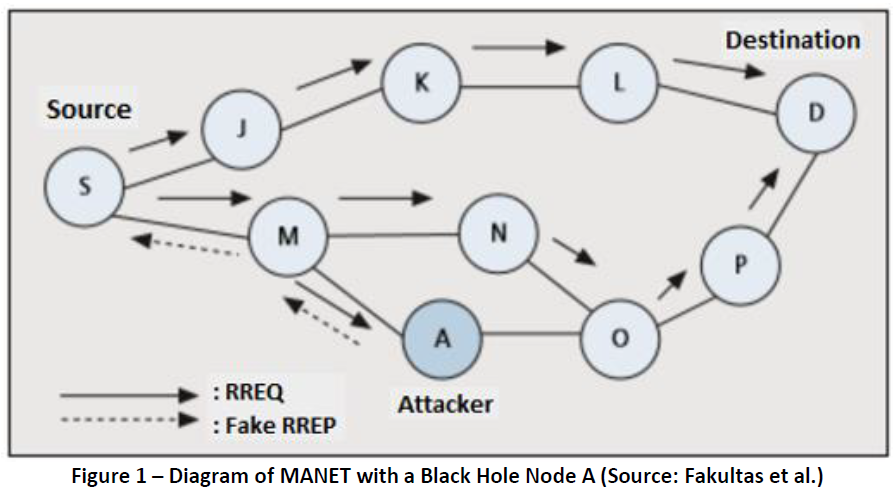

# 2023_Capstone_MANET

This repository contains the final submission for our capstone project, completed in May 2023.

As the project lead, I was responsible for overseeing the entire project, including project and team management, coordinating with stakeholders, and also developing Phase 2 and Phase 3. Thanks to the dedication and hard work of my team, this project was a resounding success, earning a High Distinction for all team members.

This page outlines the introduction and a summary of the project outcomes. All project files are organized into the appropriate folders within this repository. For more detailed information, including the final report and the code I developed for Phase 2 and Phase 3, please refer to the links below:

- [Final Report](Reports/Grp-11522-23-16%20Final%20Report.pdf)
- [Data Preparation and Machine Learning Scripts: AODV to Dataset](Data%20Preparation%20and%20Machine%20Learning%20Scripts/AODV_to_Dataset.html)
- [Machine Learning for Malicious Node Detection](ML_for_Malicious_Node_Detection.html/ML_for_Malicious_Node_Detection.html)

---

## Introduction and Description of the Project

A Mobile Ad Hoc Network (MANET) is a type of wireless network where several devices, such as radios, smartphones, laptops, cars, drones, or sensors, communicate directly without needing any pre-existing or centralized infrastructure. MANETs are self-configuring and self-maintained by their nodes, making them ideal for situations where existing network infrastructure is damaged, unavailable, or not possible such as in disaster-stricken areas, military operations, or remote regions.
For example, in a region recently devastated by an earthquake, communication infrastructure such as mobile networks may be severely damaged. In such an event, rescue and emergency services could rapidly set up a MANET to quickly establish a wireless network among their devices to exchange vital information and communications. Likewise, in military operations where fixed network infrastructure is unavailable, MANETs can enable military personnel and unmanned devices to communicate and share tactical information in real-time using wireless devices.
A commonly used routing protocol in MANETs is the Ad-hoc On-Demand Distance Vector (AODV) protocol. AODV is a reactive routing protocol, which means that it establishes routes between nodes on-demand when required rather than maintaining pre-established routes. AODV uses a route discovery mechanism where nodes broadcast route requests to find a route to a destination node. When a route is discovered, AODV establishes a temporary route and maintains it for as long as the nodes are actively communicating. AODV protocol is widely used in MANETs due to its simplicity, scalability, and adaptability to changing network topologies due to the mobility of nodes.
However, protocols like AODV are vulnerable to various types of cyber-security threats, one of the most common being black hole attacks. A black hole attack is a type of cyber-attack where a malicious node infiltrates the network and falsely claims to have the shortest route to a destination, making it the prioritized path for link establishment. Doing so attracts routing and data traffic towards it, but it drops the received packets instead of forwarding them to the desired destination. This will severely disrupt communication in the network between nodes and cause the loss of vital data, leading to performance degradation and network instability. Hence, black hole attacks can cause severe disruptions in critical operations, making them a significant security concern in MANET environments.

 

 

Figure 1 shows a diagram of a MANET where the source node S sends a route request to the destination node D. The malicious node A replies with a fake route response message, claiming to have the shortest route to node D. Node S would then establish a route to node D through node A, but the packets would be dropped by node A instead of being forwarded to the destination.
This project aimed to develop a solution using machine learning techniques that could detect black hole intruders in a MANET utilizing the AODV protocol. The project consisted of three major phases.

**Phase 1:**
In the data creation phase, a MANET network would be simulated using the NS3 simulator, incorporating the AODV routing protocol. The simulation would also include a small number of black hole nodes. Finally, the simulation would generate output files comprising various network metrics, AODV messaging, and data flow between the nodes.

**Phase 2:**
In the data preparation phase, a script would be developed to process the simulation files and convert them into a dataset that could be used to train a machine learning classifier. This would involve identifying and extracting various relevant features that could be used to detect the behaviour of black hole nodes.

**Phase 3:**
The machine learning (ML) phase would develop a machine learning process using the dataset generated in stage 2 as input to train ML classifiers to detect which neighbour nodes were black hole nodes.

---

## Summary of Outcomes

**Phase 1 - data creation phase:** A NS3 simulator was used to simulate MANET networks using the AODV protocol. Three scripts were developed in C+ to simulate the interaction of all nodes in the MANET. Black hole nodes were also introduced into the network. The NS3 scripts used were able to produce simulations of standard AODV networks. However, due to the complexity of the process, the tracing configured in the script was not producing complete logs in the AODV with black hole node simulations. Slight corrections were manually altered in the messaging logs' output to ensure it was consistent with MANET black hole node behaviour. Despite these difficulties, the standard AODV scripts output and toy Blackhole examples produced good output data that could be used in the project's next phases.

**Phase 2 - data preparation phase:** The comprehensive literature review identified the key behavioural characteristics of black hole nodes in AODV networks. From this, a complex data wrangling script was developed that would read the AODV protocol messaging between nodes from the trace files produced in the previous phase. The script would then extract key features from the messaging from which a dataset was created that could be used in the machine learning process. This phase was successful, and datasets could be produced from the trace files.

**Phase 3 - machine learning phase:** A machine learning script was developed to detect black hole nodes within the network. The datasets created by the data conversion script developed in the Data Preparation Stage were used as the input. The variables with the highest correlation to the target variable were determined and they were filtered into the final dataset for model training. Two binary classification models were developed, a random forest classifier and a support vector machine classifier. Both models could classify with 100% accuracy which nodes were black hole nodes.

In future project expansion, more work must be done to get the NS-3 simulator to improve the accuracy of the simulation of AODV networks and black hole nodes. With larger networks simulated, further and more robust training and testing of the models is required. The opportunities for future development section mentions what steps should be carried out next. However, with all the hard work put into this project, the project's final phase was successfully completed. The results demonstrate that machine learning can successfully be applied to AODV networks to detect black hole nodes accurately.

